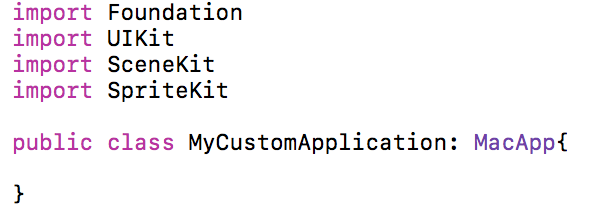
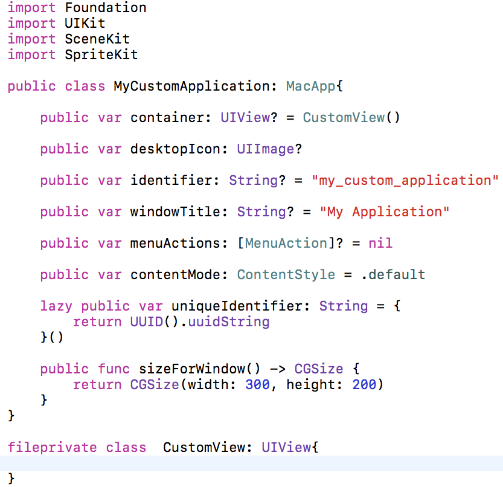
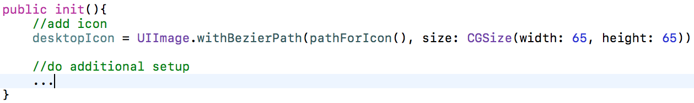

# WWDC-Collaborators
Combining WWDC 17 Scholarship Playgrounds

# How to contribution:

## Create your own .swift file in the `Collaborators` folder.

## Create a public class that conforms to the `MacApp` protocol.

## Implement `MacApp` functions and properties.

Add your custom code in the file you created and make sure all classes,protocols,enums and extensions you create are marked with `fileprivate`.

## Add initializer

Add initializer and initialize the desktop icon and do additonal setup that is needed for your application.

## Add an instance of your custom MacApp

Finally add an instance of your custom MacApp class to the desktop apps array.

